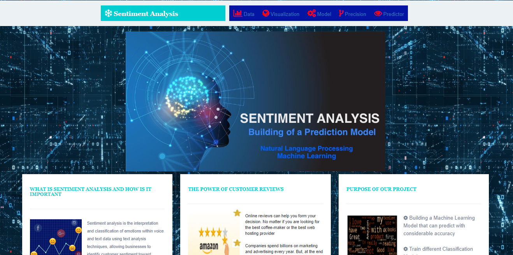
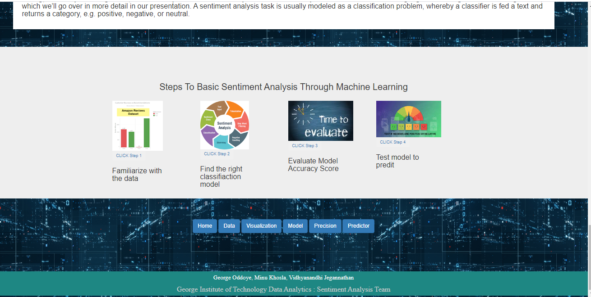
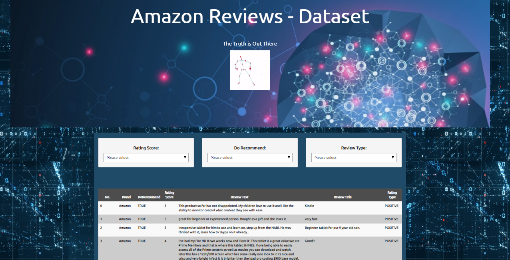

# Amazon Consumer Reviews Analysis & Prediction - Machine Learning

## Data Source
Kaggle.com is the Data source for this project
https://www.kaggle.com/datafiniti/consumer-reviews-of-amazon-products

## Skills Used
Python, HTML, CSS, Bootstrap, JavaScript, Flask, Jupyter Notebook, Machine Learning, NLP

## Aim - To develop a machine learning model that predict the consumer reviews as either Positive or Negative.

## 

## 

## 

## 

